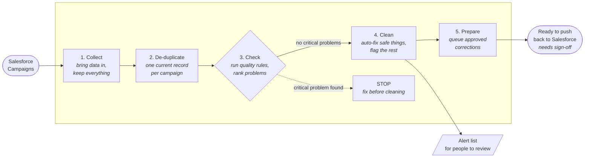

# Campaign Data-Quality POC — Business Summary

**Date:** 2026-08-05  **Scope:** Salesforce **Campaign** object only (proof of concept)

> Companion (technical) document: [campaign_azure_poc.md](campaign_azure_poc.md) — the full engineering
> detail. This page is the **stakeholder view**: what we set out to do, what it delivers, and what it costs.

---

## 1. The problem in one line

Salesforce campaign data has **duplicates, blanks, and inconsistencies** (mixed spellings, missing years,
odd figures). We need a **safe, repeatable way to clean it** — without ever changing the wrong thing.

## 2. What we set out to prove

A single, trustworthy pipeline that takes campaigns from Salesforce and makes them **clean and
report-ready**, following three promises:

1. **Keep the full history** — nothing is thrown away.
2. **One clean record per campaign** — no duplicates in the working set.
3. **Never "clean" bad data** — the tidy-up only runs when there are **no critical problems** left.

We proved it on **Campaign** first (the smallest object, ~41,000 records) because if it works here, the
same recipe repeats for the other objects by changing names only.

## 3. How it works (five simple stages)

| Stage | What happens | Plain-English purpose |
| --- | --- | --- |
| **1. Collect** | Pull campaigns from Salesforce | Bring the data in, keep everything (history + duplicates) |
| **2. De-duplicate** | Keep the latest version of each campaign | One current record per campaign |
| **3. Check** | Run the quality rules | Find the problems and rank them by severity |
| **4. Clean** | Auto-fix the safe things, flag the rest | Tidy data + a clear list of what needs a person |
| **5. Prepare** | Queue approved corrections | Ready to send back to Salesforce (with sign-off) |

Every stage keeps a checkpoint, so at any moment we can answer **"where are we?"** and safely resume — an
auditor can reconstruct the exact position without reading logs.

## 4. What the "clean" step actually does

It **tidies four things automatically** and keeps the original next to the tidied value (full transparency):

- **Currency** → standard 3-letter uppercase code (e.g. `gbp ` → `GBP`)
- **Status** → consistent spelling/spacing; **a missing status is set to `Aborted`**
- **Active flag** → a simple Yes/No
- **Year** → filled in from the campaign's start date when it's blank

It **never guesses on risky things**. Anything it can't safely fix is **flagged for a person**, not changed.

### The alert list (what the business needs to see)

Issues that can't be auto-fixed go to a simple **alert list** for the right team to review. Each item shows
whether the pipeline **already fixed it** or whether **a person still needs to act**. Today the alert list
carries the **"won exceeds total"** check — campaigns reporting more *won* money than *total* money. On the
current data this flagged **25 campaigns**. The pipeline **does not change these figures**; it surfaces them
for **finance to review**.

## 5. Demonstrated result (on Azure, 2026-08-05)

- **40,847 campaigns** cleaned. On the four auto-tidied fields (currency, status, active flag, year),
  **none needed a manual edit** — values were either already fine or safely correctable.
- **Year filled in on ~17,700 campaigns (~43%)** from their start date.
- **Currency codes** were already consistent (no changes needed).
- **Missing statuses were set to `Aborted`** so every campaign has a status (existing statuses were already
  consistent).
- **Nothing critical was touched** — the tidy-up only ran because zero critical problems remained.
- **Separately, the alert list flagged 25 campaigns** where *won* money exceeds *total* money — these need
  **finance review** (a business-logic issue, not a formatting one). The pipeline left those numbers
  untouched.

> Two different tracks: the **auto-tidy** fields needed no human (0 review); the **alert list** is where
> genuine business issues surface (25 for finance). "0 needed review" refers only to the auto-tidied
> fields — it does not mean the data is perfect.

Result: a **clean, de-duplicated, report-ready** set of campaigns, plus a short, actionable list of the
few things that genuinely need a human.

## 6. What is **not** in this POC (needs sign-off later)

- **Writing corrections back into Salesforce** is intentionally **out of scope**. Corrections are queued
  and ready, but the actual push-back needs **Salesforce admin support** and **business sign-off** — a
  separate, controlled step.

## 7. Recommendation / next steps

- **Approve** the approach on Campaign (proven end-to-end).
- **Assign owners** for the alert list (e.g. finance for "won exceeds total").
- **Confirm business rules** (e.g. is "missing status → Aborted" the right default?).
- Then **repeat the same five stages** for the remaining objects, largest last.
