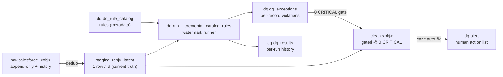

# DQ Framework — Reference & Assessment

Date: 2026-08-07. Consolidated reference for the **Data Quality (DQ) framework** in `Quality_layer_check`.

This expands on the two existing docs — do not duplicate them, read them together:
- [../DQ Frame work/DQ_framework_creation.md](../DQ%20Frame%20work/DQ_framework_creation.md) — the watermark/incremental engine and operator runbook.
- [dq_clean_staging_approach.md](dq_clean_staging_approach.md) — how DQ sits between staging and clean.

This file adds: the **object map** (real table/proc names), the **alert concept**, an honest
**"does it make sense" assessment**, and a **"can it be better" improvement list**.

---

## 0. Which DQ docs exist — and do we need them all?

**Short answer: yes — keep them all, but each has one job.** They are layers, not duplicates. This file is
the map; read the others when you need that layer.

| Doc | One-line purpose | Keep? |
| --- | --- | --- |
| **This file** (`DOCS/dq_framework_reference.md`) | The map: object/table/proc names, alert concept, assessment, improvements | ✅ start here |
| [`DOCS/dq_clean_staging_approach.md`](dq_clean_staging_approach.md) | Engineering design of staging → DQ → clean → alert, with a worked example | ✅ design |
| [`../DQ Frame work/DQ_framework_creation.md`](../DQ%20Frame%20work/DQ_framework_creation.md) | The watermark/incremental engine + operator runbook + **how to add a rule** | ✅ engine/runbook |
| [`../DQ Frame work/DQ_framework_review_checklist.md`](../DQ%20Frame%20work/DQ_framework_review_checklist.md) | Pre-run review checklist | ✅ QA gate |
| [`../DQ Frame work/DQ_sample_data_smart_checks_plan.md`](../DQ%20Frame%20work/DQ_sample_data_smart_checks_plan.md) | Idea: profile a new object → propose candidate rules | 📁 reference (not built) |
| [`../DQ Frame work/null_analysis_raw_layer.md`](../DQ%20Frame%20work/null_analysis_raw_layer.md) | Null-profiling basis for choosing rules | 📁 reference |
| [`../../mohey_work/DQ instructions.md`](../../mohey_work/DQ%20instructions.md) | How to build a per-object DQ folder (00→04) | ✅ authoring guide |
| Per-object `Tables/<obj>/0*_*.md` + `02_*_PROD_framework.sql` | EDA + rule seed + post-run analysis per object | ✅ per-object source |

**Verdict:** none is redundant — there are three doc layers (**concept → design → engine/runbook**) plus an
authoring guide and the per-object files. If you read only one, read this file, then jump to the layer you
need. (`DQ_sample_data_smart_checks_plan.md` and `null_analysis_raw_layer.md` are idea/reference notes, not
built features — keep as reference.)

---

## 1. What the framework is (in one paragraph)

A metadata-driven, **watermark-incremental** rule engine. Rules are rows in a catalog
(`dq.dq_rule_catalog`), each pointing at a staging view (the deduped "current truth"). A runner
(`dq.run_incremental_catalog_rules`) checks only rows that changed since each rule's last watermark,
writes per-record violations to `dq.dq_exceptions`, and appends a per-run summary to `dq.dq_results`.
Severity (`CRITICAL/HIGH/MEDIUM/LOW`) decides consequence: `CRITICAL` blocks the clean build; the rest are
recorded and routed to review. Issues that a machine cannot safely fix become **alerts** (`dq.alert`) for a
human to action.

---

## 2. Where DQ runs in the pipeline



**Golden rule (unchanged):** rules run on **staging**, never on raw. Raw has duplicates and history, so it
would double-count and flag stale versions.

---

## 3. Object map (what actually exists in `database/dq/`)

### Core tables
| Object | Role | Key columns |
| --- | --- | --- |
| `dq.dq_rule_catalog` | The rule definitions (one row per rule) | `rule_id`, `object_name`, `source_view`, `check_name` (`<OBJ>-NNN`), `check_type`, `target_column`, `severity`, `rule_definition`, `is_active`, `approval_status`, `process_name`. Unique on (`object_name`,`check_name`). |
| `dq.dq_exceptions` | Per-record violations (current state, upserted) | `rule_id` (FK), `record_id`, `exception_value`, `exception_details`, `first_detected_at`, `last_detected_at`, `resolution_status` (Open→Resolved), `resolved_at/by`. |
| `dq.dq_results` | Append-only run history (the evidence trail) | `check_name`, `severity`, `rows_checked`, `failed_count`, `check_status`, `details`, `checked_at`. |
| `dq.alert` | Business-facing action list | `record_id`, `check_name`, `severity`, `issue`, `current_value`, `cleaned` (1/0), `alert_status`. |

### Engine state / audit
| Object | Role |
| --- | --- |
| `dq.rule_execution_state` | Per-rule **cursor**: `last_source_watermark_value`, `rule_core_signature`, `reprocess_review_pending`, last-run stats/status. |
| `dq.rule_execution_audit` | Rule lifecycle log (discovered, core-changed-review, metadata-updated, rejected-no-watermark). |

### Procedures
| Proc | Role |
| --- | --- |
| `dq.prepare_incremental_rule_queue` | Registers rules, computes signatures, resolves the watermark column, flags core changes. Called automatically by the runner. |
| `dq.run_incremental_catalog_rules` | **The main runner.** Watermark-driven; writes exceptions + results; advances cursors. |
| `dq.run_active_catalog_rules` | Non-incremental full runner (legacy/full-scan path). |

### "Smart" / profiling helpers (bootstrap new objects)
| Proc / table | Role |
| --- | --- |
| `dq.analyze_object`, `dq.run_dynamic_field_profile` → `dq.field_profile`, `dq.profile_run` | Profile a raw/staging object (null %, distinct, patterns) to **suggest** which checks matter. |
| `dq.run_dynamic_technical_checks` → `dq.technical_result`, `dq.technical_run` | Generic technical checks (type/format sanity) before hand-written rules exist. |
| `dq.suggest_field_mappings`, `dq.apply_high_confidence_mappings` → `dq.field_mapping` | Map source columns to expected semantics to seed rules faster. |
| `dq.vw_rule_readiness` | Shows which rules are ready to run (watermark resolvable, source valid). |

> See [DQ_sample_data_smart_checks_plan.md](../DQ%20Frame%20work/DQ_sample_data_smart_checks_plan.md) for the
> profiling-to-rules idea, and [null_analysis_raw_layer.md](../DQ%20Frame%20work/null_analysis_raw_layer.md)
> for the null-profiling basis.

---

## 4. Rule types supported

`NOT_NULL`, `VALID_DATETIME`, `VALID_SALESFORCE_ID`, `VALID_BOOLEAN`, and `CUSTOM_SQL` (for
multi-column / conditional / cross-field rules such as CAM-008 `won > all`). New generic types are added by
extending the runner's template `CASE`.

Rules are also classed by intent (from `dq_clean_staging_approach.md`):
- **Enforced** — fail rows that break a hard rule.
- **Report-only / listing** — surface values for human review when there is **no approved reference list**
  (e.g. CAM-016 region listing, CAM-004 status, CAM-006 currency). Prevents false positives.

---

## 5. The watermark model (why it scales)

- Each rule stores a **cursor** = `last_source_watermark_value` (max `SystemModstamp` it has processed).
- A run checks only rows with `SystemModstamp > cursor`, writes violations, then advances the cursor.
- **No `DONE` state** — a caught-up rule simply checks 0 rows until new data arrives (`CAUGHT_UP`).
- **Rule edited?** A SHA2-256 **core signature** over the pass/fail fields changes → the rule is flagged
  `reprocess_review_pending = 1`. Old rows are **not** auto-rescanned; an operator decides reprocess vs
  forward-only. Cosmetic edits (description/severity) do not trigger review.
- **No truncate** of `dq.dq_exceptions` — it is upserted; rows that re-enter the window and now pass are
  resolved.

Run status meanings: `CAUGHT_UP`, `BATCHED` (more to drain), `FAIL` (caught up with failures),
`ERROR` (retried next run), `RUNNING`, `NULL` (never run).

---

## 6. The alert concept — yes, it exists, and here is how it works

**Question asked: "does it have a concept of alert and how does it work?"** — Yes. `dq.alert` is a
**separate, business-facing action list**, distinct from `dq.dq_exceptions` (which is the full technical
violation ledger).

**Difference in one line:** `dq.dq_exceptions` = *every* rule violation for engineers; `dq.alert` = the
*subset that a human must decide on*, phrased for stakeholders.

The distinguishing column is **`cleaned` (BIT)**:
- `cleaned = 1` → the clean step auto-corrected it (informational; safe/deterministic fix already applied).
- `cleaned = 0` → it could **not** be auto-fixed and **needs a person** (actionable).

`alert_status` moves `Open → Reviewed → Resolved` (design extends this to `Approved/Rejected`).

**Who populates it:** the clean procedure (today `clean.refresh_campaign`). It currently carries a single
real case — **CAM-008** (`AmountWonOpportunities > AmountAllOpportunities`), a genuine discrepancy that
cannot be safely auto-corrected.

**How it is meant to flow to action** (design in `dq_clean_staging_approach.md` §4):
1. Reviewer queries `dq.alert WHERE cleaned = 0 AND alert_status = 'Open'`.
2. Sets `alert_status = 'Approved'` with a decided value.
3. Approved correction goes to `writeback.<obj>_pending`.
4. An apply proc writes the value into `clean.<obj>` and marks the alert `Resolved`.
5. (Later, gated) push approved rows back to Salesforce.

**Invariant:** auto-fixes are deterministic; everything judgemental is an approved, logged action — no
silent edits.

---

## 7. Does it make sense? (honest assessment)

**Yes — the design is sound and the separation of concerns is correct.** Specifically:

**Strengths**
- **Metadata-driven**: rules are data, not code — new rules are `INSERT`s, no redeploy.
- **Incremental by watermark**: the right choice for large Salesforce tables; avoids full re-scan cost.
- **Two ledgers, two audiences**: `dq_exceptions` (engineering, upserted state) + `dq_results` (append-only
  history) + `dq.alert` (business). This is a mature pattern, not over-engineering.
- **Safe change handling**: core-signature detection stops a rule edit from silently invalidating history.
- **Gated clean**: `0 CRITICAL` before `clean.<obj>` builds is a real quality gate, not decoration.
- **Fixes stay per object**: each clean proc applies its own safe, deterministic fixes inline (Campaign
  style) — easy to read and tune, with the pre-fix value preserved in `dq_exceptions`.

**Honest caveats (where the theory is ahead of the implementation)**
- **Staging is now incremental for the curated objects.** Split table+SP builders exist for
  `campaign`, `contact`, `item_gau`, `recurring_donation` (`staging.refresh_<obj>_latest`, delete-changed +
  insert-dedup, `@FullRebuild` reset); objects without a curated column set use the generic
  `staging.refresh_object_latest`. **Clean and alerts are still proven for Campaign only** — the engine is
  generic but the clean proc + `dq.alert` writes exist just for one object; the rest are templated.
- **`dq.alert` is written inline** by each object's clean proc (Campaign's `clean.refresh_campaign` writes
  its CAM-008 directly) — there is no generic alert router; alerting is per object, like the clean builder.
- **The writeback action loop is design-only.** `writeback.*_pending` tables and the enqueue/apply procs
  don't exist yet, and `dq.alert` lacks `decided_value` / `decided_by` columns to capture a decision.
- **ETL lineage split-brain** (documented in `Files.MD`) still matters for provenance, but no longer blocks
  staging: the curated builders read only business columns + `SystemModstamp` from raw, so `contact` and
  `item` staging build regardless of the old `_etl_*` naming. Standardize the `_etl_*` columns for lineage,
  not to unblock DQ.

**Verdict:** the framework makes sense as a system; the gap is **completeness and automation**, not design.

---

## 8. Can it be better? (recommended improvements)

Ordered by leverage:

1. **Alerting is per object (inline).** Each clean proc inserts its own `dq.alert` rows (Campaign's CAM-008).
   *(If alert volume ever grows, a small shared helper could derive them from open exceptions — revisit then.)*
2. **Add decision columns to `dq.alert`** (`decided_value NVARCHAR(MAX)`, `decided_by`, `decided_at`,
   `alert_status` incl. `Approved/Rejected`). Without them a reviewer can't record an actionable decision —
   this is the missing link to writeback.
3. **Build the writeback loop** (`writeback.<obj>_pending` + `enqueue`/`apply` procs) so an approved alert
   flows into `clean.<obj>` and, later, back to Salesforce — auditable, no silent edits.
4. **One orchestrator** (`ctl.run_object_pipeline @Object`, or an ADF pipeline) that runs
   staging → DQ → clean → alert-route in order, enforces the `0 CRITICAL` gate, and logs to
   `ctl.etl_run_control`. Today stages run by hand.
5. **Standardize ETL lineage naming** (canonical `_etl_run_id` / `_etl_extracted_at_utc` /
   `_etl_source_object`) for clean provenance. No longer a staging blocker — the curated builders read only
   business columns + `SystemModstamp` — but worth doing so lineage is consistent across load paths.
6. **Turn the profiling helpers into a real bootstrap step.** `analyze_object` → `field_profile` →
   `suggest_field_mappings` already exist; wire them into a "profile a new object → propose candidate rules"
   flow so onboarding object #N is minutes, not a manual rewrite.
7. **Add a severity→consequence config table** instead of hard-coding CRITICAL-blocks-clean, so each object
   can tune what blocks vs warns.
8. **Monitoring**: surface `dq_results` failure spikes and `ERROR` run statuses (email / Log Analytics),
   and add smoke tests (row counts, unique-Id, 0-critical) per stage.
9. **Retire the legacy engine** (`dq.technical_run` written by the old procs) once the watermark runner is
   the single path, to remove the inert dual-write confusion noted in `DQ_framework_creation.md`.

---

## 9. Quick start (operator)

The runner is **one generic engine for every object**. Omit `@ObjectNameFilter` (it defaults to `NULL`) to
run **all** objects incrementally in one call; pass it to scope to a single object. Every run is
watermark-driven, so a caught-up object simply checks 0 new rows.

```sql
-- Daily incremental run, ALL objects (NULL filter = every object, watermark-driven)
EXEC dq.run_incremental_catalog_rules
     @MaxRowsPerRule = 100000,
     @MaxExceptionsPerRule = 500;

-- Daily incremental run, one object
EXEC dq.run_incremental_catalog_rules
     @ObjectNameFilter = N'Campaign',
     @MaxRowsPerRule = 100000,
     @MaxExceptionsPerRule = 500;

-- Full drain for one object (no batch cap), resolve stale opens
EXEC dq.run_incremental_catalog_rules
     @ObjectNameFilter = N'Campaign',
     @MaxRowsPerRule = 0,
     @MaxExceptionsPerRule = 2000,
     @ResolveWhenFull = 1;

-- Force a FULL re-scan of one rule after a core change (operator decision)
UPDATE dq.rule_execution_state
SET last_source_watermark_value = NULL, reprocess_review_pending = 0
WHERE rule_id = @RuleId;
EXEC dq.run_incremental_catalog_rules @ForceRuleId = @RuleId, @MaxRowsPerRule = 0;

-- Business action list: what needs a human
SELECT object_name, check_name, severity, issue, current_value, alert_status
FROM dq.alert
WHERE cleaned = 0 AND alert_status = N'Open'
ORDER BY severity, created_at;
```

See `DQ_framework_creation.md` §"How to check rule status" for the full monitoring query set.

---

## 10. Guideline — add a new object to clean + auto-fix

The DQ engine is object-agnostic (metadata-driven, one runner for all objects). The **clean layer is one
builder per object** (modeled on Campaign) so each table is easy to read and tune, and each clean proc
writes its own `dq.alert` rows inline.

### 10.1 Canonical names (get these exactly right)
`@object_short` = the `staging.<obj>_latest` table-name segment. `@object_name` = the **catalog** name in
`dq.dq_rule_catalog` (they differ — multi-word objects use an underscore). Get `@object_name` right in the
per-object gate: a wrong name matches 0 rows and would **silently bypass the CRITICAL gate**.

| Object | `@object_short` (staging) | `@object_name` (catalog) |
| --- | --- | --- |
| Campaign | `campaign` | `Campaign` *(reference builder)* |
| Contact | `contact` | `Contact` |
| Item (GAU) | `item_gau` | `Item_GAU` |
| Recurring Donation | `recurring_donation` | `Recurring_Donation` |
| Sponsorship | `sponsorship` | `Sponsorship` |
| Sponsorship Unit | `sponsorship_unit` | `Sponsorship_Unit` |
| Opportunity | `opportunity` | `Opportunity` |
| Payment | `payment` | `Payment` |
| Item Allocation | `item_allocation` | `Item_Allocation` |

### 10.2 Steps
1. **Staging:** ensure `staging.<obj>_latest` is built and **unique per 18-char Id**
   (`EXEC staging.refresh_object_latest @object_short = N'<obj>';`). The clean unique index on `Id`
   depends on this.
2. **Rules:** rules exist in `dq.dq_rule_catalog` (from the object's `02_*_PROD_framework.sql`); run the DQ
   runner so exceptions/results populate and **0 CRITICAL** is achievable.
3. **Auto-fix (optional):** write safe fixes **inline** in the object's clean proc (Campaign style).
   **Fix only safe, deterministic things** — a fix must be lossless and only touch rows it can actually
   correct; leave true garbage as an open exception. You do **not** need auto-fixes for every rule or
   object — none is a valid state (clean still gates + tags REVIEW).
4. **Clean builder (per object):** create `clean/<obj>_table.sql` (persistent table) + `clean/refresh_<obj>_SP.sql`
   (build proc) by copying Campaign's `clean/campaign_table.sql` + `clean/refresh_campaign_SP.sql` and
   adapting columns + fixes. The proc gates at 0 CRITICAL, MERGEs changed staging rows by `Id`, applies safe
   fixes inline, tags REVIEW, and inserts its `dq.alert` rows. Reset with `@FullRebuild = 1`.
5. **Verify:** `clean.<obj>` built at 0 CRITICAL; format-only issues corrected; `dq.alert` populated with
   the right `cleaned` flags; `ctl.clean_state` watermark advanced.

### 10.3 Update the docs when you add/change an object
Keep these in sync so the reference never drifts from the code:
- **This file** — add the object's names to §10.1 if missing; note anything object-specific.
- **`dq_clean_staging_approach.md`** — tick the per-object best-practice checklist.
- **`Tables/<obj>/03_*_ANALYSIS.md`** — record which rules became `AUTO_FIX` vs stayed `DETECT_ONLY`.
- **`mohey_work/DQ instructions.md`** — only if a new *pattern* of safe fix is introduced (not per column).
